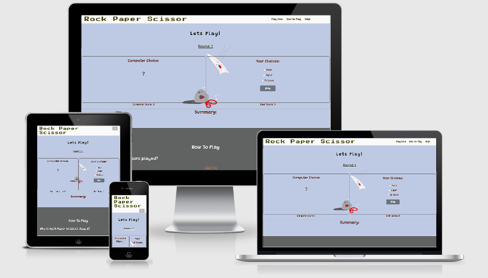
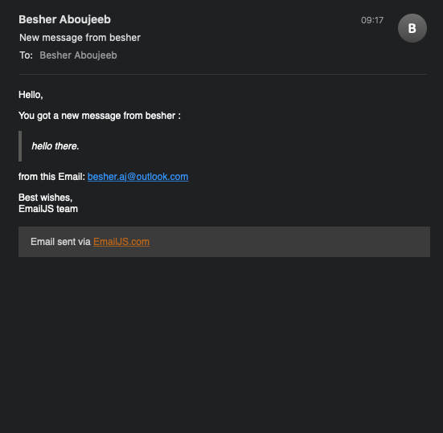

# Interactive Frontend Development Milestone 2 "Rock Paper Scissors" Project:
Rock Paper Scissors project is popular and old game created to entertain users playing against the computer, both user and computer score will increase when one of them win, when the game is a tie nothing changes, to keep it more interesting there is a round count, it can be used as a marketing or advertisement tool to get clients attention and entertain them while explotring other prodcuts.

# User Story:

**as a user:**
* ability to play rock paper scissors with the computer.
* the winner will get one point in each round.
* counting rounds of each time you play.
* ability to learn about the game.
* email form to learn more about user experience or to report any problems with the game.
* resposive website that can be used on any smart phone tablet or desktop device.

**as a website developer:**
* learning more about users throw an email form.
* teach users how to play the game.
* new experience for users to count winning times.

## Wireframes:
The wireframes designed by Balsamiq tool, [link to wireframes!](wireframes/wireframes.pdf)

# Features:
## Existing Features:
* Navigation menu bar that linked to different sections in the website.
* hover over the the navbar key wores in the navbar to see new keyword color.
* The menu bar will switch to a button that collapse in the mobile and tablet version.
* the played game features and ability to play against the computer.
* Ability to play the game and the round and winning score change every time played.
* Documentation section about the game and how to play it.
* ability to fill a form and express your experience or report a problem.
* footer with links to social media.
* hover over the icons in the footer section to see new icon color.
* Responsive design that can be used on any device.

## Future Features:
* users can play the game against each others.
* keep record of the users who achieved highest score as top 10.

# Technology Used:
* **Languages**:HTML5, CSS3, Javascript.
* **Frameworks**: Bootstrap.
* **Font Awesome**: The Footer icons.
* **Balsamiq**:Designed the wireframes.
* **VSCode**: This whole project code written using VScode.
* **Github**: The whole project commited and pushed to github repository and published on Github pages.
* **JS Email**: Used with the contact form. 

# Testing:
## Unit Testing:
the project has been tested by jasmine tool, [link to the test results](https://besheraj.github.io/milestone2/test/test.html)
* if computer chose "rock" and user chose "scissors" it returns "The Computer Won"
* if computer chose "paper" and user chose "rock" it returns "The Computer Won"
* if computer chose "scissors" and user chose "paper" it returns "The Computer Won"
* if computer chose "scissors" and user chose "rock" it returns "You Won"
* if computer chose "rock" and user chose "paper" it returns "You Won"
* if computer chose "paper" and user chose "scissors" it returns "You Won"
* if computer chose "scissors" and user chose "scissors" it returns "The Game is a tie"
* if computer chose "rock" and user chose "rock" it returns "The Game is a tie"
* if computer chose "paper" and user chose "paper" it returns "The Game is a tie"
* if the user chose other than "rock" "paper" "scissors" will return console log "error" (but thats not possible because the user will check one of three options)
* if the computer win the computer score will increase by one.
* if the user win the user score will increase by one.
* every time the game played the round count will advance by one.
## UI Testing:
### Nav bar  testing:
*  ability to use a button at the top to expand the nav bar when using mobile or tablet.
*  click on "Play now" will direct you to the game section.
*  click on "how to play" will direct you to how to play section.
*  click on "help" will direct you to the contact form section.
*  hover over  "Play now"  and the color will change. 
*  hover over "how to play" and the color will change. 
*  hover over "help" and the color will change. 
### Game testing:
* check a choice from the user choice and click on play the game and the computer choice will be auto generated and the summary will show the winner and the winner score will be updated.
* click on play again and the round count will be increased by one as the winner score will be increased too.
* if the game is tie both computer and user score will stay the same.
### How to play section testing:
* if you scroll down you will see the how to play section.
### Form testing:
* if you scroll down more you will see the contact form section.
* if you enter your name and click on "send now" you will be asked to fill in your email address field.
* if you enter your email and click on "send now" you will be asked to fill in your name field.
* if you enter your message and click on "send now" you will be asked to fill in your name field.
* if you enter your name and email and click on "send now" you will be asked to fill in your message field.
* if you enter your name and message and click on "send now" you will be asked to fill in your email address field.
* if you enter your email and message and click on "send now" you will be asked to fill in your name field.
* if you enter your name, email and message and click on "send now" you will get an alert "Your message has been sent.".
* if you enter your name, email and message and click on "send now", and some how there is an error with the server you will get an alert "FAILED... please try again later!".
* onec the form completetd and the alert "Your message has been sent." pop up the developer will receive an email with the the form details as follows:

### Footer testing:
* the bottom of the page there is a footer with links to social media website in a new tab.
*  if you click on the facebook icon it will direct you to the facebook website in a new tab.
*  if you click on the twitter icon it will direct you to the twitter website in a new tab.
*  if you click on the instagram icon it will direct you to the instagram website in a new tab.
*  if you click on the youtube icon it will direct you to the youtube website in a new tab. 
*  hover over the facebook icon and the color will change. 
*  hover over the twitter icon and the color will change. 
*  hover over the instagram icon and the color will change. 
*  hover over the youtube icon and the color will change. 

### Responsive
The design was tested using chrome devtools for the following devices:
* Responsive (googlechrome dev tools).
* Moto G4.
* Galaxy S5.
* Pixel 2.
* Pixel 2 XL.
* Iphone 5/SE.
* Iphone 6/7/8.
* Iphone 6/7/8 Plus.
* Iphone X .
* Ipad.
* Galaxy Fold.
* Surface Duo.
### W3 Schools Testing:
* HTML code passed by w3schools html validator without errors.
* CSS code passed by W3schools CSS jigsaw without errors.

# Deployment

## GitHub Pages
The [live version](https://besheraj.github.io/milestone2/) of this site is hosted using Github Pages.
To deploy Off "Rock Paper Scissors" from its GitHub repository, follow the below steps:
1. Log in to Github.
2. Select https://github.com/besheraj/milestone2.
3. From the menu items near the top of the page, select Settings.
4. Scroll down to the GitHub Pages section.
5. Under Source click the drop-down menu labelled None and select Master Branch.
6. On selecting Master Branch the page is automatically refreshed, the website is now deployed.
7. Scroll back down to the GitHub Pages section to retrieve the link to the deployed website.

## Locally
To run this project locally, follow the below steps:
To clone this project from GitHub:

1. Click the link to the Off The Beaten Track repository.
2. Under the repository name, click Code button.
3. In the Clone with HTTPs section, copy the clone URL for the repository.
4. In your local IDE open Git Bash.
5. Change the current working directory to the location where you want the cloned directory to be made
6. Type git clone and then paste the URL you copied in Step 3.
git clone https://github.com/besheraj/milestone2.git .
Press Enter. Your local clone will be created.
7. To remove the origin link from your IDE type git remote rm origin.

**Alternatively** you can download the ZIP folder of this project by clicking the Code button (as you did in step 2) and selecting Download ZIP It can then be unpacked into your desired location
Open the index.html file to run the project locally Further reading and troubleshooting on cloning a repository from GitHub here.

# Credits
All the photos in this project downloaded from "https://hipwallpaper.com/"